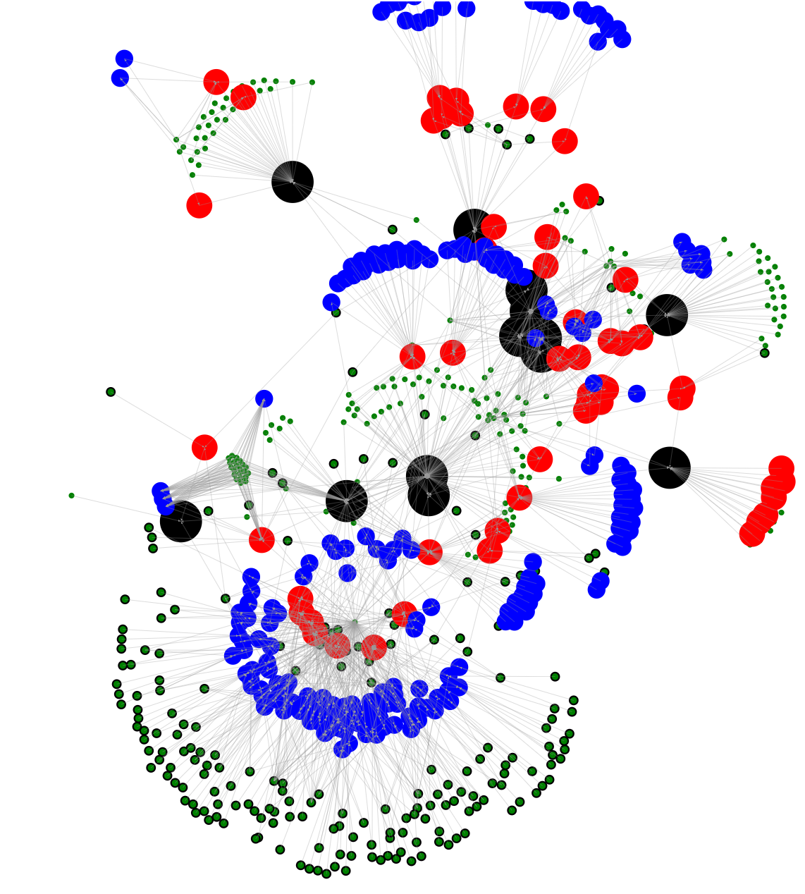

  

<i><b>Open Innovation Platform.</b></i>

<i>Enabling society to collaborate. Building a better future, together.</i>

# Analytics Playground
Alkemio has a structured domain model with a growing set of data representing users and organizations working together on topics they care about: Challenges!

This repository is for exploring ways for extracting value from this data. This can be via aggregation, usage in reports or by visualizing the information.

## Connectivity Graph
The connectivity graph is meant to provide a way of navigating the connectivity within the Hubs and Challenges hosted on Alkemio.

The implementation in this repository is a such that the vizualization can be created / extended separate from the Alkemio server / client - to allow for rapid experimentation.

There are multiple steps involved in running it:
* **Obtain the data**: run the queries in the `graphql` folder, and save the results as the values in the related files in the `src/data` folder.
  * For example, run the `users.graphql` query using the playground, and then copy the results as the exported constant in the `src/data/users.ts` file.
* **Generate the graph**: the raw data from Alkemio server needs to be converted into nodes / edges that can be vizualized.
  * The command to do this is `npm run generate-graph`.
  * The results from this command are stored in the `output` folder and used in the next stage.
* **Generate the vizualization**: the graph data then needs to be placed into a canvas so that it can be displayed. The repository currently has a crude approach whereby the graph data is directly inserted into a html page template.
  * The page template is `src/display/page-template.html`.
  * To generate a new version of this run the following command: `npm run generate-vizualization`.
  * The results from this command are also placed in the `output` folder, with the file name having the current date in it.

Then it is simply a question of openning the resulting html page in a browser!

A sample image generated using this approach is shown below:

  </a>

